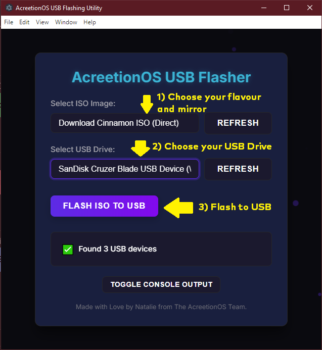
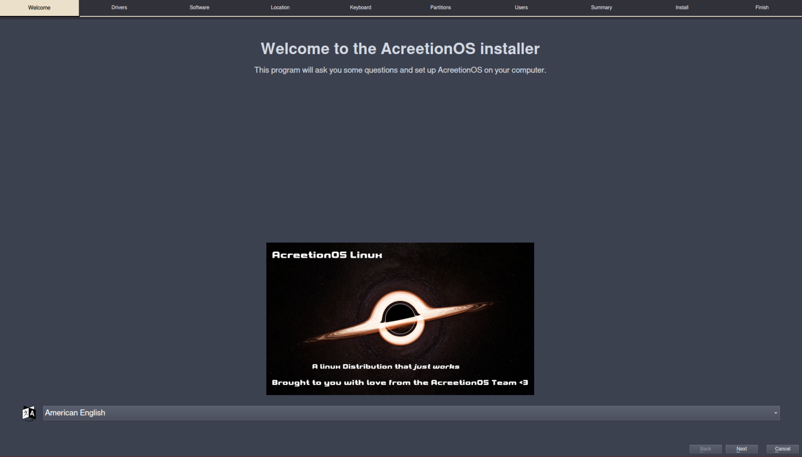
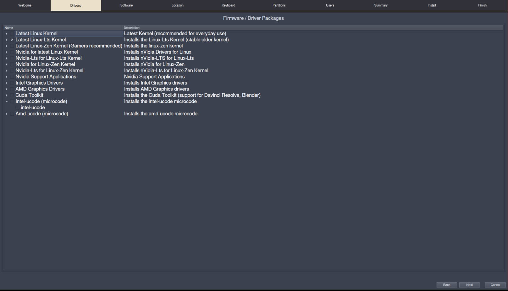
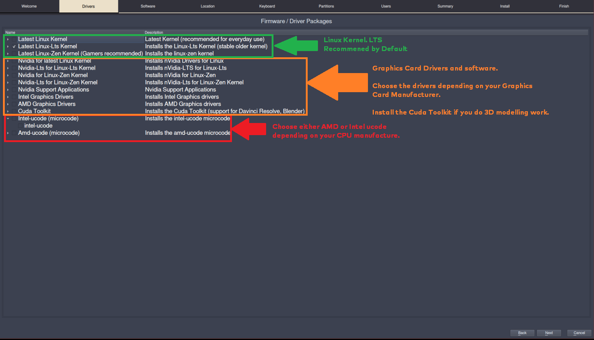
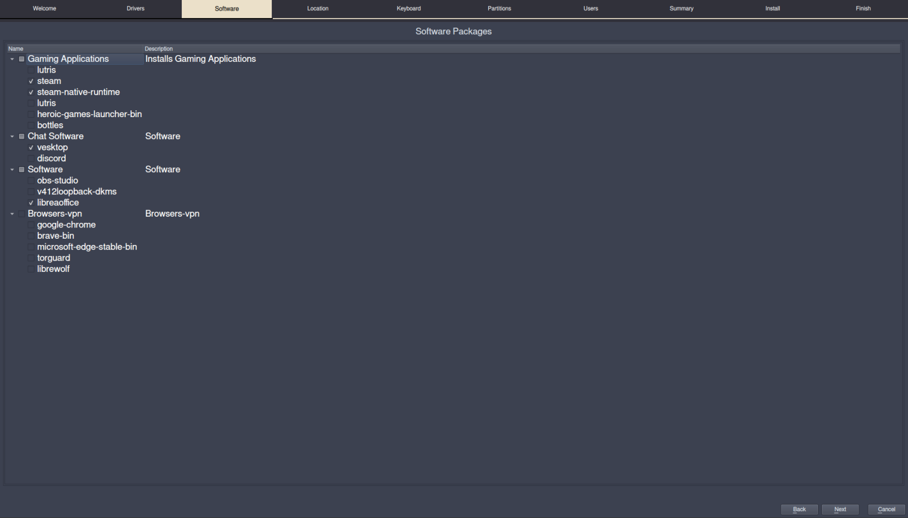
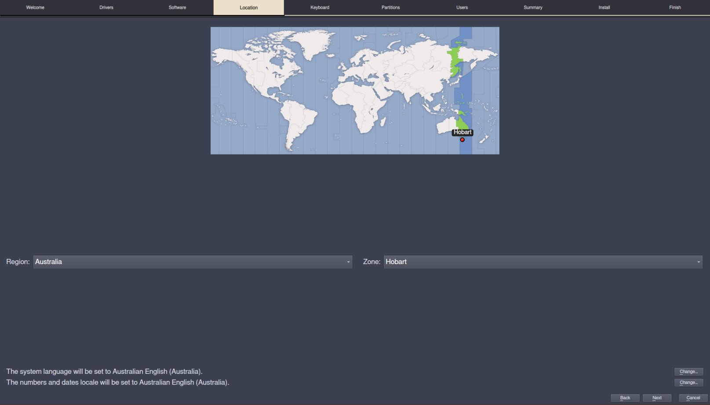
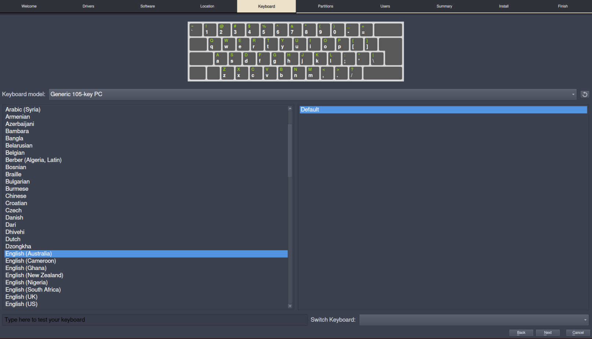
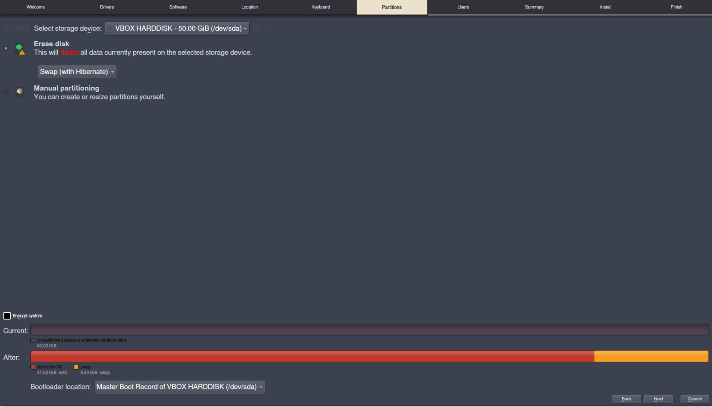
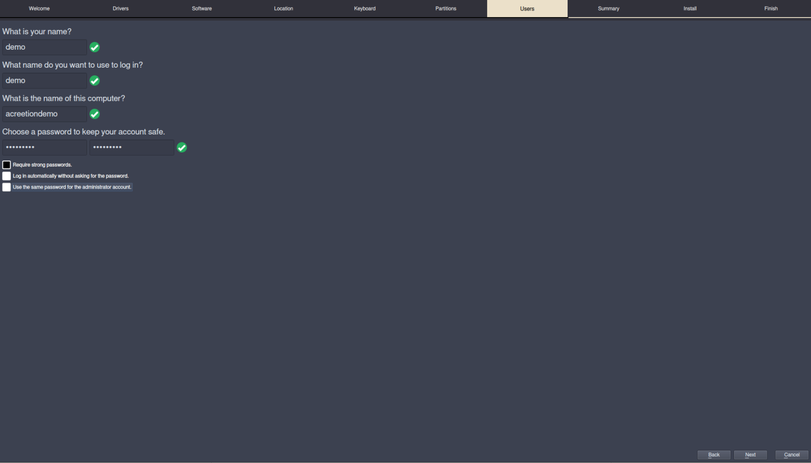
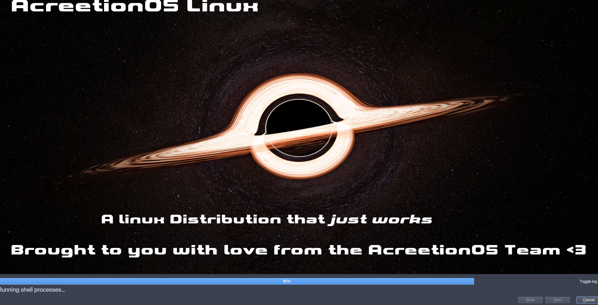

# AcreetionOS: Install Guide

Welcome! This page will guide you through installing AcreetionOS. We keep it **as simple as possible** so even if you’ve never installed Linux before, you’ll be fine.  

> **Important:** AcreetionOS currently requires an **active internet connection** to install.

---

## Preperation - Windows

### - Step 1

Download the bootable USB creator from the AcreetionOS Website - [AcreetionOS USB Flasher](https://iso.acreetionos.org:8448/Flashing_Utility/dist/AcreetionOS_USB_Flasher_Setup_1.0.0.exe)! 

### - Step 2

Choose your AcreetionOS flavour - Either Cinnamon, Gnome or StormOS and the mirror you want to use, or download it manually and burn it yourself. ***Not Recommended****
  
  
 !Windows version will follow with a Rufus Promt for putting the ISO onto a usb! 
 
 For linux install see the [main install doc](./installation.md)
 
## Live Enviorment and Installing AcreetionOS

### Step 3 - Booting Live Enviorment

Boot your PC and boot from your USB or dvd you created. (Methods on how to do this vary, please consult your computer user manual or motherboard guide for more.)

Wait for the AcreetionOS Live Systerm to start. Select your Language and press Next.

### Step 4a - Kernel and Drivers
*** Uh oh this screen looks scary *** 

No need to panic, that's why I'm here providing this installation guide. 

This screen is where we will be choosing the drivers for our computer. - I will split in into 3 sections; Kernel, CPU and GPU* (see footnote)

As I have AMD based system, I choose AMD drivers and AMD ucode options. Then click next.

### Step 4b - Software

On the next screen we have the option to choose what software we want to install. I chose Steam, the Steam runtime, vesktop and libre office to install.

### Step 4c - Location and keyboard

The next two screens are fairly simple. First is setting your location.

The other is setting your keyboard.

### Step 4d - Partitioning

The next screen is for setting up your drive partitions. 
 ***THIS WILL  ERASE ALL DATA IF YOU AREN'T CAREFUL*** 
In the screenshot below, I am erasing the HDD and creating it with a swap partition. Once you are happy press next.

### Step 4e - Username and Password Screen

The next screen is where we will set up our username and password. I used the user demo and password of "acreetion". 
There are 3 checkboxes underneath the text entry boxes; 'Require strong passwords', 'Log in automatically', and 'Use the same password for admistrator account'
A black checkbox means the option is ***not*** selected; for this tutorial, I will disable strong passowrds and enable auto login.

### Step 4f - Summary and Install

Once you get to here, you will be shown an overview of your settings and have the ability to change them. If they all look good, press the install button. 
A pop up will show asking you if you are sure you want to make changes to the disk. This is your final chance to make sure you won't loose your data if you're installing over an old disk.
Press the confirmation and away we go!

---

## What’s Included by Default?

We ship AcreetionOS with a selection of software we believe **every user will need**:

- **Firefox** web browser (ready to go after install).
- **Pamac** — a friendly software store where you can install and remove apps without touching the terminal.
- Basic tools for everyday use.

---

## Installing Extra Apps

Want Google Chrome or something else? You have options:

- **AUR (Arch User Repository)** — a huge collection of community-maintained software.
- You can enable AUR support directly in Pamac:
  1. Open Pamac.
  2. Go to **Preferences** (you may need your password).
  3. Enable **AUR**.
  4. Search for your app (e.g., “google-chrome”) and click install.

---

## We’re Always Improving

We work on AcreetionOS **almost every day**.  
If you ever get stuck or have questions:
- We’re happy to help — even if we can’t reply instantly, we usually have Discord open.

---

## Need Help or Have Questions?

Join our friendly **AcreetionOS Community on Discord**:  
🔗 [https://discord.gg/AJ6uuvtDXY](https://discord.gg/AJ6uuvtDXY)

---

##  If You’re the “I Read the Manual” Type

Some people like to dive into **documentation** instead of asking questions.  
If that’s you, check out:  
📚 [AcreetionOS Wiki – Problems & Fixes](https://wiki.acreetionos.org/en/latest/problems/)  

Just know… the wiki is written in the **classic old-school Linux style**, which is great if you like scrolling through text walls.  
Most newer users these days just:
- Ask on Discord.
- Or use AI to get an answer in 10 seconds.  

But hey, if you’re a “manual and coffee” person — we love you too. ❤️

---

Ready to experience computing that just works? AcreetionOS Cinnamon is waiting for you.

#### Footnote
CPU = Central Processing Unit
GPU = Graphicz Processing Unit or Graphics Card.